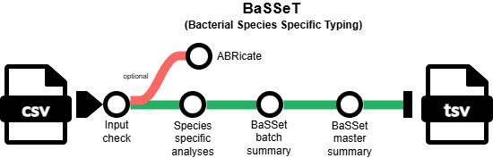

<p align="center">
  
  
</p>

# 🧬 BaSSeT

[](https://www.nextflow.io/)
[](https://www.docker.com/)
[](https://sylabs.io/docs/)
[](https://apptainer.org/docs/user/latest/)
[](LICENSE)
[](https://github.com/MDHHS-Bioinformatics/basset/releases)

[](https://doi.org/10.5281/zenodo.20856443)

**BaSSeT** (Bacterial Species-Specific Typing) is a bioinformatics pipeline for species-specific typing of bacteria. It takes a samplesheet with reads (FASTQ) and assembly (FASTA) files of multiple isolates from different organisms; performs species-specific typing analysis, produces a summary report per batch and combines new and prior results into a master results file.


### Suggested workflow

BaSSeT is designed to analyze QC-trimmed reads and genome assemblies generated by sequencing pipelines such as [`PHoeNIx`](https://github.com/CDCgov/phoenix), [`Bactopia`](https://github.com/bactopia/bactopia), [`TheiaProk`](https://public-health-bacterial-genomics-theiagen.readthedocs.io/en/latest/theiaprok.html), custom workflows, or retrieved from public databases such as [`AllTheBacteria`](https://github.com/AllTheBacteria/AllTheBacteria) and [`NCBI`](https://www.ncbi.nlm.nih.gov/datasets/genome/). The pipeline provides species-specific predictions for serotyping or serogrouping, virulence gene detection, and other analyses that complement higher-resolution typing approaches such as MLST and cgMLST. These outputs can support epidemiological investigations and genomic population analyses.

>BaSSeT is not intended to be an end-to-end read QC or assembly pipeline. Instead, it is designed to avoid duplicating upstream quality-control steps while providing a portable and reproducible framework for typing diverse bacterial organisms.


## 🌟 Highlights
- 🦠 Processes **multiple organisms in parallel**
- 🧬 Supports 24 different typing analyses
- 📄 Generates summary results with tool versions per batch
- 📄 New and prior results are appended to a master file

## 📊 Workflow Overview
<p align="center">

</p>

High-level steps:
1. Input check
2. ABRicate if `--abricate_db <database>` specified
3. Species specific analyses
4. Batch summary generation
5. Master summary generation

For full workflow details check [`Workflow documentation`](docs/workflow.md)

---

## 🚀 Usage

### 1️⃣ Requirements

* [`Nextflow`](https://docs.seqera.io/nextflow/install) (`>=22.10.1`)
* One container runtime:
  * [`Docker`](https://docs.docker.com/engine/installation/) (recommended for local runs)
  * [`Apptainer`](https://apptainer.org/docs/user/latest/) (recommended for HPC)
  * [`Singularity`](https://www.sylabs.io/guides/3.0/user-guide/)

### 2️⃣ Prepare samplesheet
Prepare a samplesheet (CSV) to define sample files and organisms:

```csv
sample,fastq_1,fastq_2,assembly,organism
SAMPLE_1,/path/S1_R1.fastq.gz,/path/S1_R2.fastq.gz,/path/S1.fasta,Escherichia_coli
SAMPLE_2,/path/S2_R1.fastq.gz,/path/S2_R2.fastq.gz,/path/S2.fasta,Salmonella
SAMPLE_3,/path/S3.fastq.gz,,/path/S3.fasta,Shigella
SAMPLE_4,,,/path/S4.fasta,Pseudomonas_aeruginosa
SAMPLE_5,/path/S5_R1.fastq.gz,/path/S5_R2.fastq.gz,/path/S5.fasta,Legionella_pneumophila

```

**Input format description**

| Column       | Description                                               |
| ------------ | --------------------------------------------------------- |
| `sample`     | Unique sample ID                                          |
| `fastq_1`    | Path to trimmed read 1 (leave empty if not available)             |
| `fastq_2`    | Path to trimmed read 2 (leave empty for single-end, ONT or assemblies) |
| `assembly`   | FASTA assembly                                            |
| `organism`   | Supported organism name (can be `Other` if running ABRicate for any other species)                                  |

>[!IMPORTANT]
> - Most analyses require assemblies as input. However, tools such as [`el_gato`](https://github.com/CDCgov/el_gato) and [`SeqSero2`](https://github.com/denglab/SeqSero2) may provide more accurate results when reads are supplied.
> - Reads are required for [`ShigaTyper`](https://github.com/CFSAN-Biostatistics/shigatyper), [`SeroBA`](https://github.com/sanger-pathogens/seroba), and [`ARIBA`](https://github.com/sanger-pathogens/ariba). If reads are not provided for a sample, these analyses will be skipped for that sample.

>[!NOTE]
>If the reads are from ONT, add the flag `--ont` when running your analyses. ONT reads are only supported for [`ECTyper`](https://github.com/phac-nml/ecoli_serotyping), [`SeqSero2`](https://github.com/denglab/SeqSero2), and [`ShigaTyper`](https://github.com/CFSAN-Biostatistics/shigatyper)

**Supported inputs per tool**
| Organism                         | Tool                                                                 | Aim                                                                                             | fastq1                                      | fastq2                                      | Assembly                                  |
|----------------------------------|----------------------------------------------------------------------|--------------------------------------------------------------------------------------------------|---------------------------------------------|---------------------------------------------|---------------------------------------------|
| _Acinetobacter baumannii_         | [`Kaptive`](https://github.com/klebgenomics/Kaptive) with [Wyres et. al](https://doi.org/10.1099/mgen.0.000339) database                  | Serotyping based on K and OC antigens                                                           | -                                           | -                                           | ✔️     |
| _Escherichia coli_                | [`ECTyper`](https://github.com/phac-nml/ecoli_serotyping)             | Serotyping based on O/H antigens; optional pathotyping (only when using `--ecoli_pathotypes`)                                           | <span style="color:orange">Fallback ⚠️</span> (only when ONT) | - | <span style="color:green">Preferred ✔️</span> |
| _Haemophilus influenzae_          | [`HICap`](https://github.com/scwatts/hicap)                           | Serotyping based on _cap_ locus (a–f)                                                             | -                                           | -                                           | ✔️     |
| _Klebsiella pneumoniae_ complex   | [`Kleborate`](https://github.com/klebgenomics/Kleborate)              | Serotyping (K/O), MLST, virulence genes                                                          | -                                           | -                                           | ✔️     |
| _Legionella pneumophila_          | [`el_gato`](https://github.com/CDCgov/el_gato)                        | Sequence‑based typing (SBT)                                                                     | <span style="color:green">Preferred ✔️</span>  | <span style="color:green">Preferred ✔️</span>  | <span style="color:orange">Fallback ⚠️</span> |
| _Legionella pneumophila_          | [`ABRicate`](https://github.com/tseemann/abricate) with [`ReporType`](https://github.com/insapathogenomics/ReporType/tree/main/databases) databases                   | O‑antigen serogrouping (_wzm/wzt_) and subsepcies                                                                 | -                                           | -                                           | ✔️     |
| _Listeria monocytogenes_          | [`LisSero`](https://github.com/MDU-PHL/LisSero)                       | Serogrouping/serotyping (O/H)                                                                         | -                                           | -                                           | ✔️     |
| _Neisseria gonorrhoeae_           | [`NGMASTER`](https://github.com/MDU-PHL/ngmaster)                     | porB/tbpB typing; AMR typing                                                                    | -                                           | -                                           | ✔️     |
| _Neisseria meningitidis_          | [`meningotype`](https://github.com/MDU-PHL/meningotype)               | Serogrouping (capsule); MLST; BAST; MenDeVAR                                                               | -                                           | -                                           | ✔️     |
| _Pseudomonas aeruginosa_          | [`Pasty`](https://github.com/rpetit3/pasty)                           | Serotyping based on O antigen                                                                   | -                                           | -                                           | ✔️     |
| _Salmonella_                      | [`SeqSero2`](https://github.com/denglab/SeqSero2)                    | Serotyping and antigenic profile                                                                | <span style="color:green">Preferred ✔️</span> (can be ONT) | <span style="color:green">Preferred ✔️</span> (optional for single-end or ONT) | <span style="color:orange">Fallback ⚠️</span> |
| _Salmonella_                      | [`SISTR`](https://github.com/phac-nml/sistr_cmd)                      | Serovar prediction via antigen genes + cgMLST                                                   | -                                           | -                                           | ✔️     |
| _Shigella_                        | [`ShigaTyper`](https://github.com/cfsan-biostatistics/shigatyper)     | Serotyping + ipaB                                                                                | ✔️ (can be ONT) | ✔️ (optional for single-end or ONT) | - |
| _Shigella_                        | [`ShigEiFinder`](https://github.com/LanLab/ShigEiFinder)              | Shigella/EIEC diff.; serotyping; virulence plasmid                                              | <span style="color:orange">Fallback ⚠️</span>     | <span style="color:orange">Fallback ⚠️</span>     | <span style="color:green">Preferred ✔️</span>      |
| _Staphylococcus aureus_           | [`AgrVATE`](https://github.com/VishnuRaghuram94/AgrVATE)              | _agr_ locus typing                                                                                 | -                                           | -                                           | ✔️     |
| _Staphylococcus aureus_           | [`sccmec`](https://github.com/rpetit3/sccmec)                         | SCCmec cassette typing                                                                           | -                                           | -                                           | ✔️     |
| _Staphylococcus aureus_           | [`spaTyper`](https://github.com/HCGB-IGTP/spaTyper)                   | _spa_ repeat typing                                                                                | -                                           | -                                           | ✔️     |
| _Streptococcus dysgalactiae_          | [`emmtyper`](https://github.com/MDU-PHL/emmtyper)                     | _emm_ type assignment                                                                              | -                                           | -                                           | ✔️     |
| _Streptococcus pneumoniae_        | [`pbptyper`](https://github.com/rpetit3/pbptyper)                     | PBP typing                                                                                       | -                                           | -                                           | ✔️     |
| _Streptococcus pneumoniae_        | [`SeroBA`](https://github.com/sanger-pathogens/seroba)                | Serotyping via _cps_ locus                                                                         | ✔️     | ✔️     | -                                           |
| _Streptococcus pyogenes_          | [`emmtyper`](https://github.com/MDU-PHL/emmtyper)                     | _emm_ type assignment                                                                              | -                                           | -                                           | ✔️     |
| _Vibrio parahaemolyticus_         | [`Kaptive`](https://github.com/klebgenomics/Kaptive) with [`Zomer Lab`](https://github.com/aldertzomer/vibrio_parahaemolyticus_genomoserotyping) databases                 | K/O serotyping                                                                                   | -                                           | -                                           | ✔️     |
| _Vibrio cholerae_                 | [`ARIBA`](https://github.com/sanger-pathogens/ariba)                  | Detect _ctxA, ctxB, tcpA, rstR_                                                                    | ✔️     | ✔️     | -                                           |
| _Vibrio cholerae_                 | [`Kaptive`](https://github.com/klebgenomics/Kaptive) with [`VicPred`](https://doi.org/10.3389/fmicb.2021.691895) OAGC database                 | O‑antigen serotyping                                                                             | -                                           | -                                           | ✔️     |
| _Other_ (and any supported organism)           | [`ABRicate`](https://github.com/tseemann/abricate)                    | Locus detection, any db via `--abricate_db`                                                      | -                                           | -                                           | ✔️     |

[`ABRicate`](https://github.com/tseemann/abricate) bundles multiple databases for the detection of resistance determinants and virulence factors. This tool is optional and available for any organism in the sample sheet when using `--abricate_db <database>`. Only one database can be used per run:

| Database        | Description                                              | Gene Types                           |
|-----------------|----------------------------------------------------------|---------------------------------------|
| [argannot](https://doi.org/10.1128/aac.01310-13)                      | Antibiotic resistance gene annotation                    | AMR genes                              |
| [bacmet2](https://doi.org/10.1093/nar/gkt1252)                        | Bacterial biocide & metal resistance genes               | Metal/biocide resistance               |
| [card](https://doi.org/10.1093/nar/gkac920)                                | Comprehensive Antibiotic Resistance Database             | AMR genes                              |
| [ecoh](https://doi.org/10.1099/mgen.0.000064)                     | *E. coli* virulence genes (subset)                         | Virulence factors                      |
| [ecoli_vf](https://github.com/phac-nml/ecoli_vf)                     | Expanded *E. coli* virulence gene set                    | Virulence factors                      |
| [megares](https://doi.org/10.1093/nar/gkac1047)                            | Antibiotic resistance ontology                            | AMR genes                              |
| [ncbi](https://doi.org/10.1038/s41598-021-91456-0) | NCBI AMRFinder+ gene set                                 | AMR genes                              |
| [plasmidfinder](https://doi.org/10.1128/AAC.02412-14) | Plasmid replicon typing                                  | Plasmid replicons                      |
| [resfinder](https://doi.org/10.1093/jac/dkaa345)                  | Resistance gene detection                                 | AMR genes                              |
| [upec_expec_vf](https://github.com/FordeGenomics/ST167_Code/blob/main/UPEC-ExPEC_VF/UPEC_ExPEC_VF.tsv)                     | UPEC/ExPEC virulence markers                             | Virulence factors                      |
| [vfdb](https://doi.org/10.1093/nar/gkae968)                               | Virulence Factor Database                                | Virulence genes                        |
| [victors](https://doi.org/10.1093/nar/gky999)                         | Bacterial virulence database                             | Virulence genes                        |      

### 3️⃣ Run
Now, you can run the pipeline using:

```bash
nextflow run MDHHS-Bioinformatics/basset \
  -profile apptainer \
  --input samplesheet.csv \
  --outdir basset_results
```

For advance run including species-specific analyses and ABRicate:
```bash
nextflow run MDHHS-Bioinformatics/basset \
  -profile apptainer \
  --input samplesheet.csv \
  --outdir basset_results \
  --abricate_db vfdb \
  --ecoli_pathotypes \
  --max_memory 50.GB \
  --max_cpus 8 \
  --max_time 4.h
```

For more details and further functionality, please refer to [`Usage documentation`](docs/usage.md) and the [`Parameter documentation`](docs/parameters.md)


## 📂 Outputs
Results are organized by **organism** except by the ABRicate results:


```text
📁 <outdir>/
├── 📁 <Organism>/
|    └── 📄<sample>_<tool>_<out_name>.tsv
|    └── 📄<sample>_<tool>_summary.tsv
├── 📁 abricate/  (only if --abricate_db <database>)
|    └── 📄<sample>_abricate_<db>.tsv
├── 📄basset_summary_batch.tsv
└── 📄basset_summary_master.tsv

```
Key outputs:
* BaSSeT summary batch
* BaSSeT summary master

For more details about the output files and reports, please refer to the [`Output documentation`](docs/output.md)


## 👥 Credits

BaSSeT was built and is maintained by the Genomic Analysis Unit at the Michigan Department of Health & Human Services (MDHHS) Bureau of Laboratories. This pipeline was developed by [Karla Vasco](https://github.com/vascokarla) using the nf-core template.

Additional conceptual guidance and scientific input were provided by [Arianna Miles-Jay](https://github.com/amilesj) and [Heather Blankenship](https://github.com/HeatherBlankenship).

## 🤝 Contributions
Contributions, issues, and pull requests are welcome! If you would like to contribute to this pipeline, please see the [`Contribution guidelines`](CONTRIBUTING.md). 

## 📚 Citations

If you use BaSSeT for your analysis, please cite the following doi:

Vasco K., Blankenship H. & Miles-Jay A. (2026). 
MDHHS-Bioinformatics/basset: v1.0.0 (v1.0.0). 
Zenodo. https://doi.org/10.5281/zenodo.20856443

An extensive list of references for the tools used by the pipeline can be found in [`CITATIONS.md`](CITATIONS.md).

## ⚠️ Disclaimer
This repository is not a source of government records but is intended to increase collaboration and collaborative potential on public health related projects. Materials and information in this repository are intended to share information and collaboratively develop analysis workflows. 

The workflows and pipelines reflect the current understanding of the software and biological questions being answered and may be updated as needed and pursuant to further analysis and review. No warranty, expressed or implied, is made by MDHHS Bureau of Laboratories as to the functionality of the software and related material nor shall the fact of release constitute any such warranty. Furthermore, the software is released on condition that the MDHHS Bureau of Laboratories shall not be held liable for any damages resulting from its authorized or unauthorized use. 


## 🔒 Privacy Notice
Use of this service is limited only to non-sensitive and publicly available data. Users must not use, share, or store any kind of sensitive data like health status, provision or payment of healthcare, Personally Identifiable Information (PII) and/or Protected Health Information (PHI), etc. under any circumstance.

## 📜 License
This project is released under the [**MIT License**](LICENSE).
