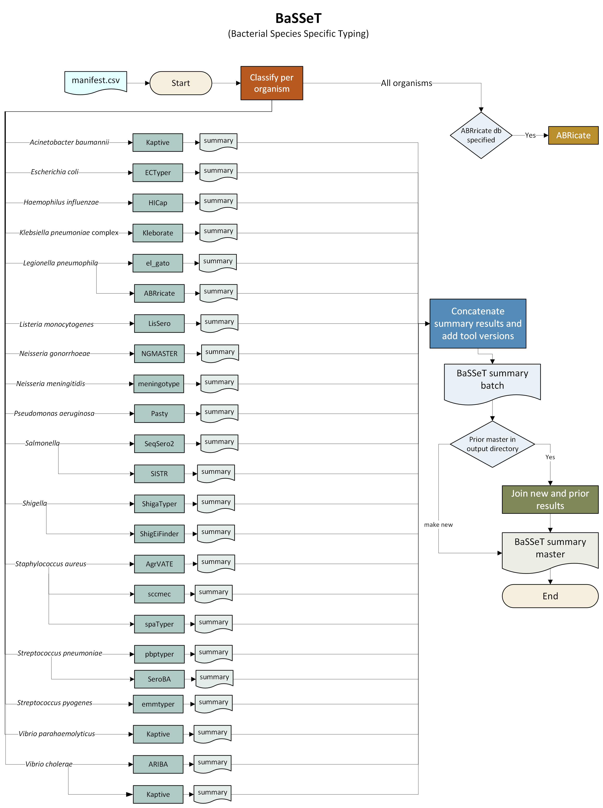

# 🧬 Pipeline Workflow

This document describes the analytical workflow implemented in **BaSSeT**.

The pipeline processes sequencing data using a series of modular steps implemented in **Nextflow DSL2**. Each step is executed independently and automatically parallelized when possible.

---

# 📊 Workflow Overview

---

# 🔬 Pipeline Stages
1. Input check.
2. Running ABRicate if database is specified.
3. Running species specific analyses.
4. Generating BaSSeT summary results for the batch (TSV).
5. Appending BaSSeT batch results to a master database (TSV).
